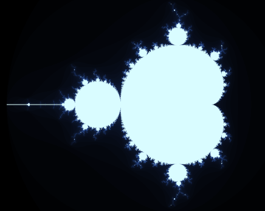

# The Mandelbrot Set

> The Mandelbrot set is a two dimensional set with a relatively simple definition that exhibits great complexity, especially as it is magnified.

According to [wikipedia](https://en.wikipedia.org/wiki/Mandelbrot_set)

This repository contans simple standalone HTML / JavaScript application which renders this set via [WebGL](https://www.khronos.org/webgl/wiki/Main_Page).

# Examples

 